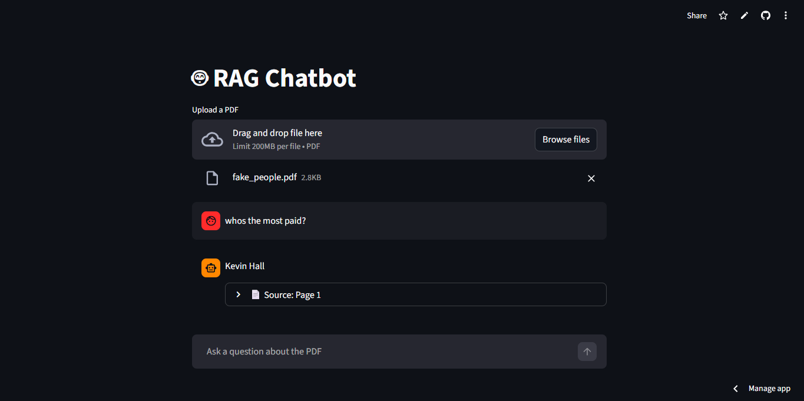

# RAG Chatbot

[](https://ragchatbotaz.streamlit.app/)

A **Retrieval-Augmented Generation (RAG) Chatbot** built with **Streamlit** and **LangChain** that allows you to upload PDFs and chat with their content. The app uses TF-IDF embeddings for fast similarity search and integrates with Google Gemini API for generating responses.


## Features

1. Upload and process PDF documents.
2. Split PDFs into manageable chunks for better context retrieval.
3. Retrieve relevant chunks based on your query using TF-IDF embeddings.
4. Chat with your documents in natural language.
5. Maintains conversation context using a buffer memory.

## Installation

1. Clone the repository:

```bash
git clone https://github.com/BellilxDhaker/RAG_Chatbot.git
cd RAG_Chatbot
```

2. **Create a virtual environment**
```bash
python -m venv venv
```

3. **Activate the virtual environment**
```bash
# Windows
venv\Scripts\activate

# macOS / Linux
source venv/bin/activate
```

4. Install the dependencies:

```bash
pip install -r requirements.txt
```

5. Set up your Gemini API Key

Obtain a **Gemini API Key** from [Google AI Studio](https://studio.google.com/) and store it as an environment variable.  

- Create a `.env` file at the root of the project.
- Add your Google API key:

```env
GOOGLE_API_KEY=your_api_key_here
```

> **Note:** Do **not** push your `.env` file to GitHub. Keep it secret.

6. Run the app:

```bash
streamlit run rag_chatbot.py
```

## Usage

1. Upload a PDF document.
2. Ask questions about the content.
3. The chatbot will return answers using the uploaded PDF as context.

## Project Structure

```
RAG_Chatbot/
│
├─ rag_chatbot.py        # Main Streamlit app
├─ utils.py              # Utilities for PDF processing and embeddings
├─ data/                 # Folder to store PDF files
├─ src/assets/images/    # Images for README
├─ requirements.txt      # Project dependencies
└─ .env                  # Environment variables (not tracked in Git)
```

## Demo

You can try the live demo here: [RAG Chatbot on Streamlit](https://ragchatbotaz.streamlit.app/)
